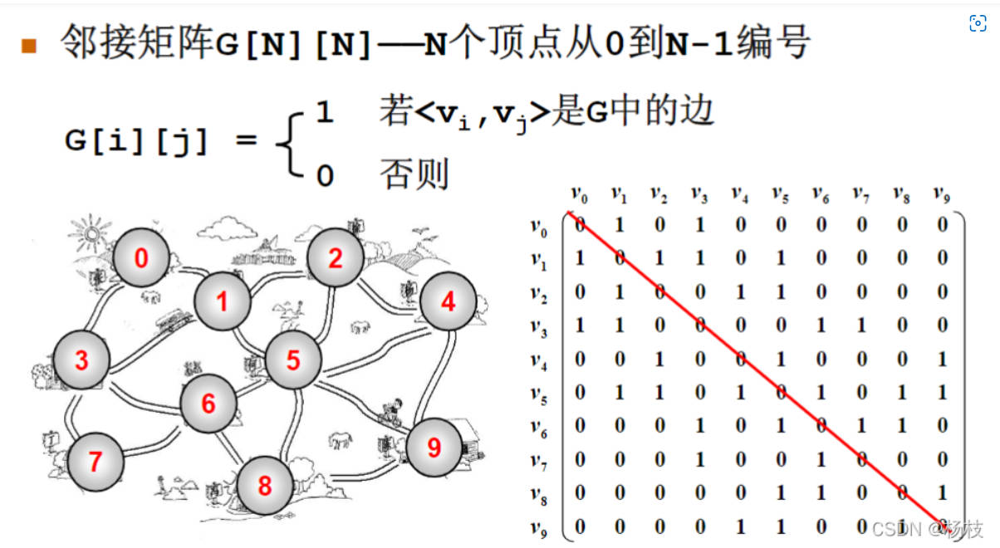
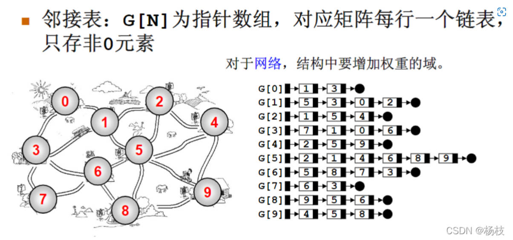

## 存储
首先要清楚深搜和广搜应该是出现在图中的，只是因为树是一种特殊的图
因此也可以采用与图同样的方式进行存储
存储方式一：稠密图（边很少） ====> 邻接矩阵 g[a][b] 表示存储从a到b的边（长）


存储方式二：稀疏图（一般都是10w条边的样子） ====> 邻接表

```cpp
// 对于每个点k，开一个单链表，存储k所有可以走到的点。h[k]存储这个单链表的头结点
int h[N], e[N], ne[N], idx;

// 添加一条边a->b
void add(int a, int b)
{
    e[idx] = b, ne[idx] = h[a], h[a] = idx ++ ;
}

// 初始化
idx = 0;
memset(h, -1, sizeof h);
```


## 板子 _ 来自yxc
具体的注意事项，我在每个模板题的代码中都备注了，代码结合题一起看
时间复杂度 $O(n+m)$, n 表示点数，m 表示边数
(1) 深度优先遍历 —— 模板题 [AcWing 846. 树的重心](https://www.acwing.com/problem/content/848/)
```cpp
int dfs(int u)
{
    st[u] = true; // st[u] 表示点u已经被遍历过

    for (int i = h[u]; i != -1; i = ne[i])
    {
        int j = e[i];
        if (!st[j]) dfs(j);
    }
}
(2) 宽度优先遍历 —— 模板题 AcWing 847. 图中点的层次

queue<int> q;
st[1] = true; // 表示1号点已经被遍历过
q.push(1);

//当队列不空
while (q.size())
{
    //取到当前的队头
    int t = q.front();
    //将已经取到的队头出队
    q.pop();

    //利用取到的队头来拓展其后续的邻接表
    for (int i = h[t]; i != -1; i = ne[i])
    {
        int j = e[i];
        if (!st[j])
        {
            st[j] = true; // 表示点j已经被遍历过
            q.push(j);
        }
    }
}
```
拓扑排序 —— 模板题 AcWing 848. 有向图的拓扑序列
时间复杂度 $O(n+m)$, n 表示点数，m 表示边数
```cpp
bool topsort()
{
    int hh = 0, tt = -1;

    // d[i] 存储点i的入度
    //将入度为0的点放到队列，待会用于找拓扑序
    for (int i = 1; i <= n; i ++ )
        if (!d[i])
            q[ ++ tt] = i;

    while (hh <= tt)
    {
        int t = q[hh ++ ];

        for (int i = h[t]; i != -1; i = ne[i])
        {
            int j = e[i];
            //如果剥离一个入度之后，入度为0了，表示是一个可以用的拓扑序，放到队列q中 
            if (-- d[j] == 0) 
                q[ ++ tt] = j;
        }
    }

    // 如果所有点都入队了，说明存在拓扑序列；否则不存在拓扑序列。
    return tt == n - 1;
}

作者：yxc
链接：https://www.acwing.com/blog/content/405/
来源：AcWing
著作权归作者所有。商业转载请联系作者获得授权，非商业转载请注明出处。
```